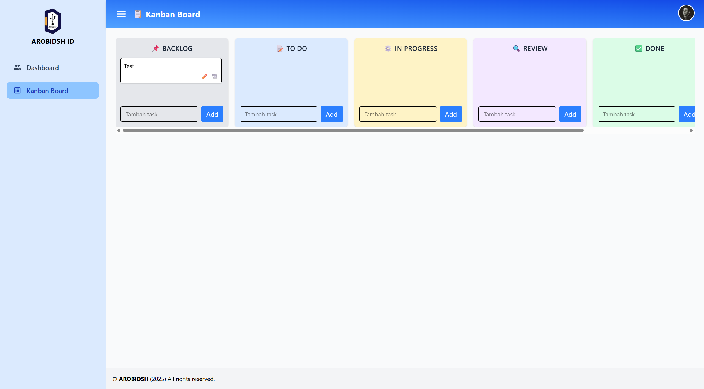
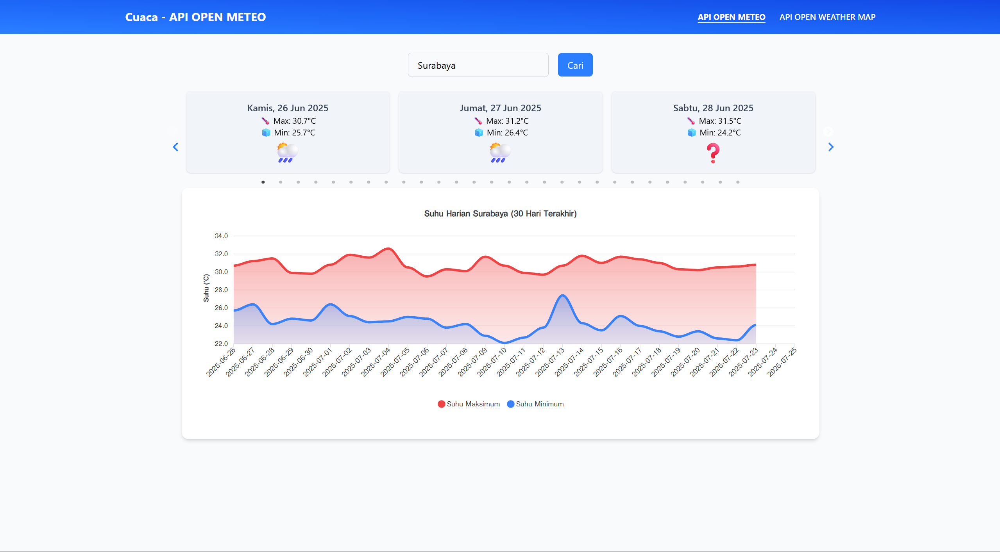
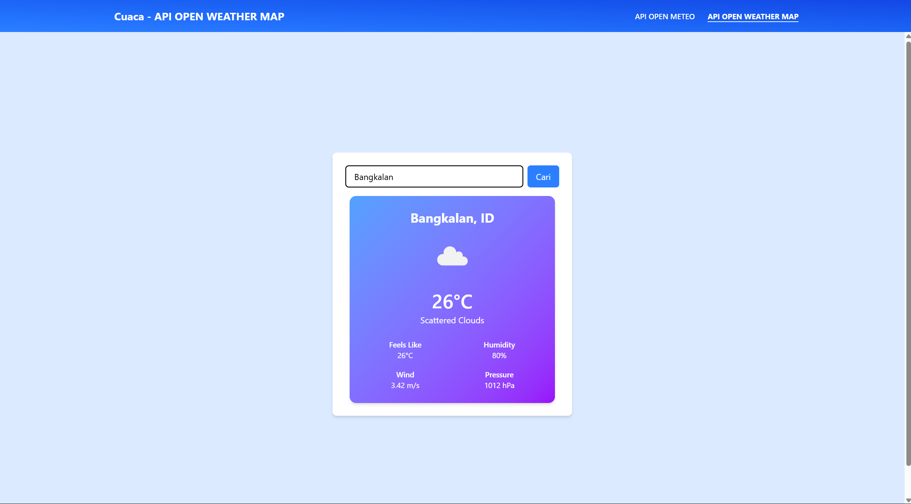
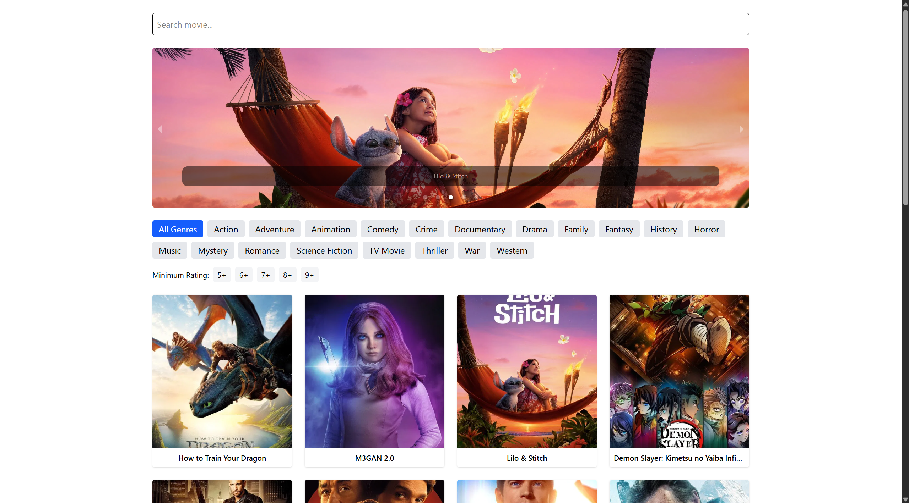
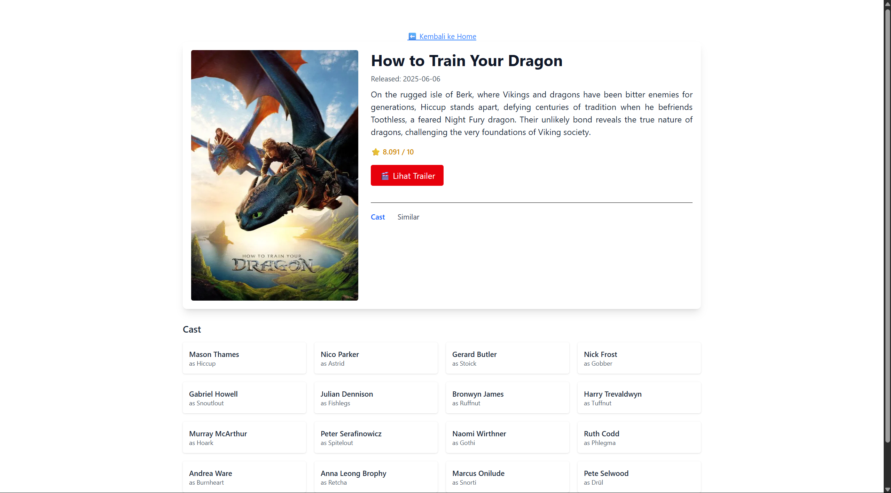
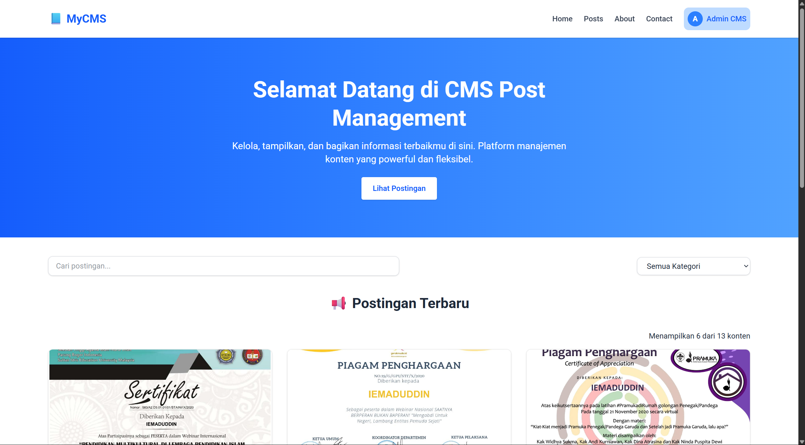
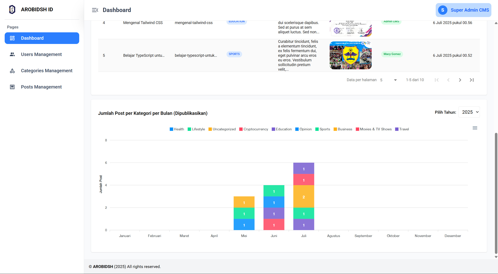

# Proyek React

---

## Daftar Proyek

#### Beginner

1. To-Do List App ✅
   
2. Weather App ✅
   
   

3. Movie Search App ✅
   
   

#### Intermediate

1. Portal Berita (CMS): ReactJs + Express + PostgreSQL ✅
   
   

1. Event Management System: ReactJs + Laravel + PostgreSQL **(In Progress)**

#### Advanced

1. Enterprise Inventory & Asset Management System: ReactJs + Laravel + MySQL **(To-Do)**
2. E-Learning Platform (Like Udemy): Next.js + Express + PostgreSQL **(To-Do)**
3. SaaS Project Management App (like Trello/ClickUp): MERN (MongoDB + Express + React + Node.js) **(To-Do)**
