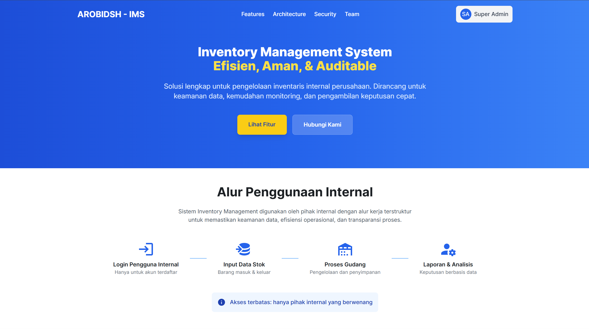
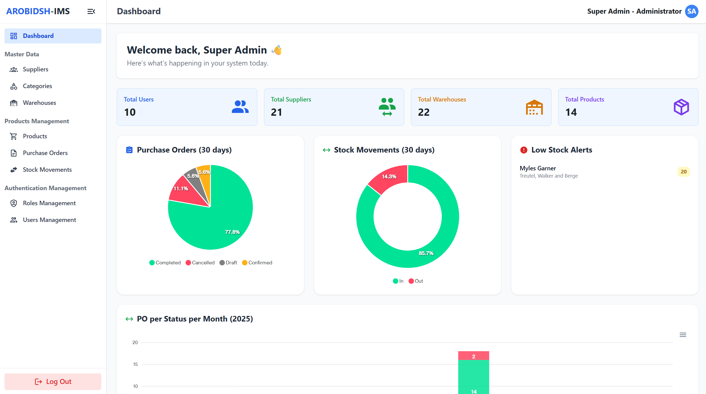
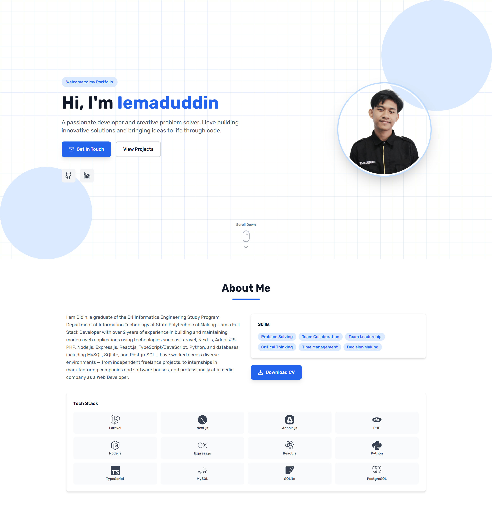
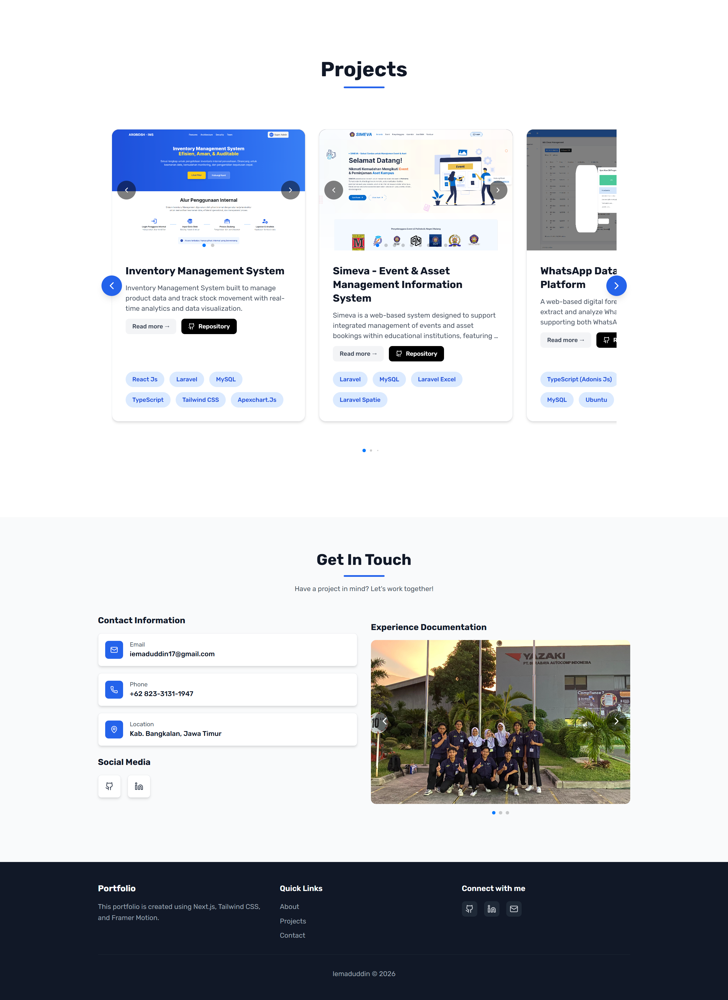

# Proyek React.Js

---

#### Basic React.Js

1. To-Do List App ✅
   
2. Weather App ✅
   
   

3. Movie Search App ✅
   
   

---

#### Real Case

1. Portal Berita (CMS): ReactJs + Express + PostgreSQL ✅
   
   
2. Inventory Management System (IMS): ReactJs + Laravel + Inertia.Js + MySQL ✅
   
   
3. Portofolio: Next.Js ✅ ([Portofolio](https://iemaduddin.github.io/))
   
   
